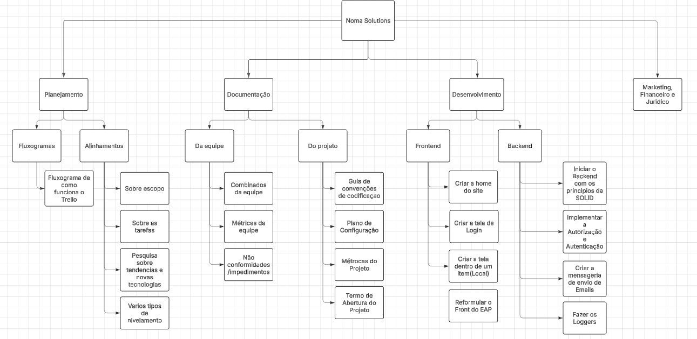
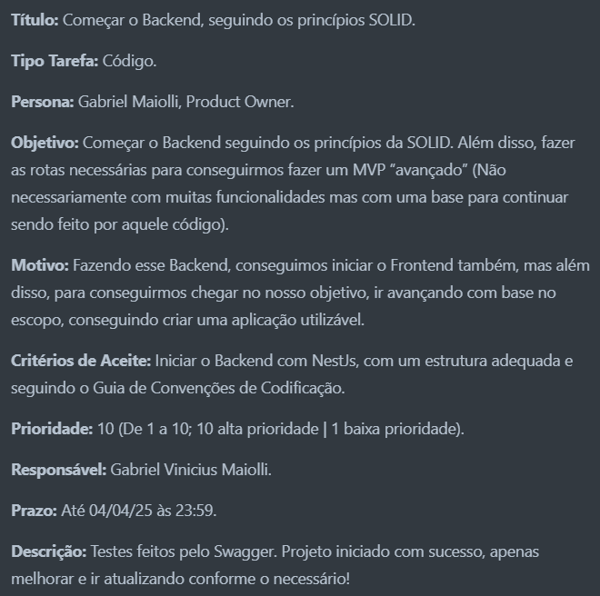
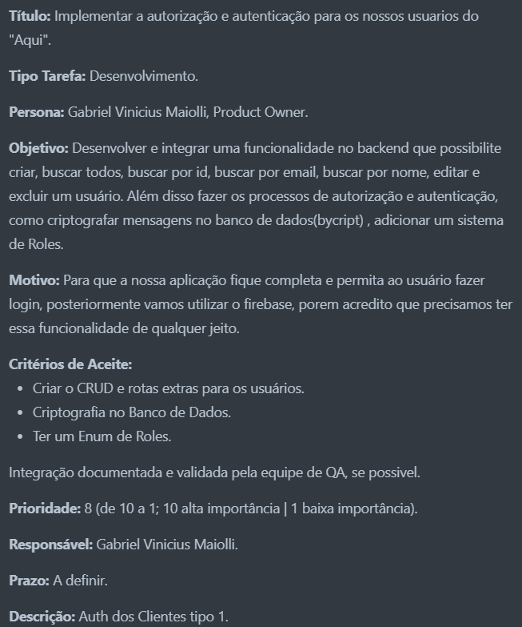
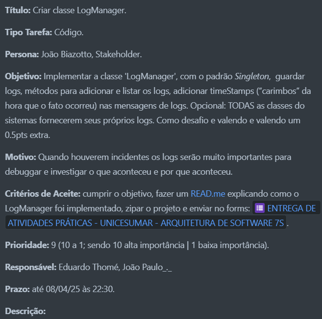

## Estrutura Analítica do Projeto Completo
### De 09/04/2025 -> Atualizado -> 14/04/2025 

**Para ver o diagrama no lucidchart [clique aqui](https://lucid.app/lucidchart/c4e99bf2-af1c-4f5f-9933-e0916c39d1bd/edit?viewport_loc=-139%2C431%2C2675%2C1238%2CHWEp-vi-RSFO&invitationId=inv_55773bf5-c7cb-4330-ad39-05a875fe79ad](https://lucid.app/lucidchart/c4e99bf2-af1c-4f5f-9933-e0916c39d1bd/edit?viewport_loc=580%2C294%2C3326%2C1546%2CHWEp-vi-RSFO&invitationId=inv_55773bf5-c7cb-4330-ad39-05a875fe79ad)))**

Alunos:

NOME: Bruno Batista Carrião Moreno
RA: 24284115-2

NOME: Gabriel Malavazi Rodrigues
RA:22145231-2

NOME: João Paulo de Andrade Gonçalves 
RA: 22012646-2

NOME: Eduardo Thomé
RA: 22110037-2

NOME: Gabriel Vinicius Maiolli
RA: 22120200-2

Decidimos decompor a EAP por produto (partes do software) e não por fases do projeto,
porque estamos realizando tarefas de diversos tipos, como documentação, desenvolvimento 
e planejamento simultaneamente. As partes que estão no nível mais baixo do diagrama já 
estão de um tamanho em que estão objetivas o suficiente para serem atribuídas para uma
pessoa responsável por fazê-las (Pacote de Trabalho).

Cards das tarefas na mesma ordem em que estão no diagrama (de cima para baixo)

## BACKEND
---

- Card de iniciar backend:
  

---

- Card da autenticação:
  

---

- Card de mensageria:
  

---

- Card do logManager:
  

---
## FRONTEND

---
## DO PROJETO

---
## DA EQUIPE

---
## ALINHAMENTOS

---
## FLUXOGRAMAS
